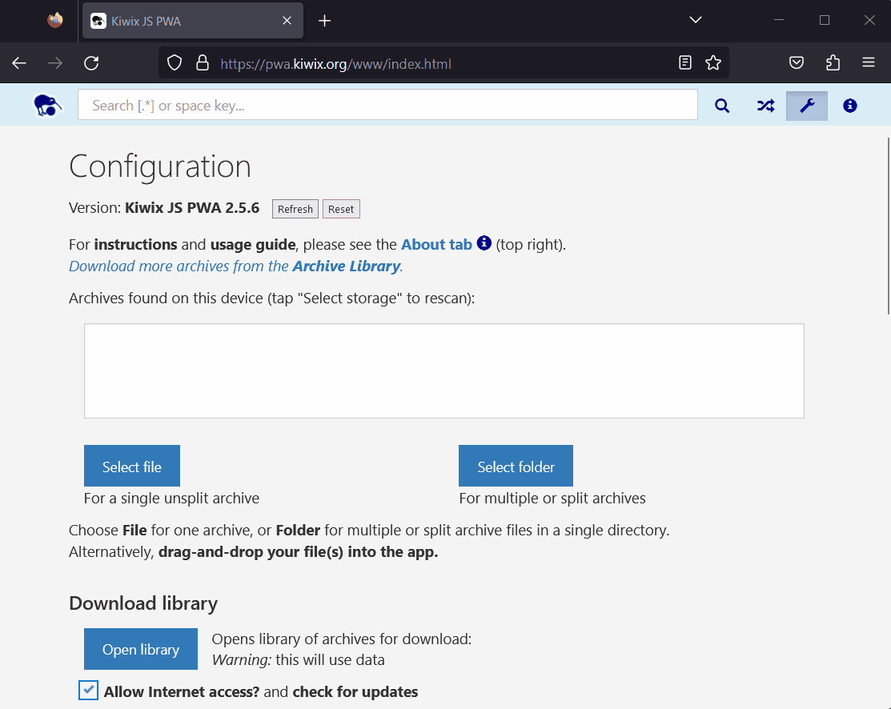

# Picking a folder of ZIM archives

Simply visit **_[pwa.kiwix.org](https://pwa.kiwix.org)_** in a modern browser. Read more after the demo:

## Use the File System Access API or the Webkitdirectory API

All modern desktop browsers now allow you to pick a folder of ZIM archives and switch quickly between archives in the folder. **Chromium browsers** (e.g. Chrome, Edge) use the
[File System Access API](https://developer.mozilla.org/en-US/docs/Web/API/File_System_Access_API) to enable file and folder picking, and to remember the selected folder across
app launches. **Firefox** uses the [Webkitdirectory API](https://developer.mozilla.org/en-US/docs/Web/API/HTMLInputElement/webkitdirectory) to achieve a very similar effect as
demoed above.

## Why do I have to give permission again after relaunch?

This is a browser security feature. You can override it by using the Origin Private File System if available on your device and browser (see
below). However, it's a very quick click or two in most browsers to authorize access, and once you give permission to access a folder, all the
files in that folder become accessible with no further permission prompts.

If you want a version of the app that doesn't ask for permission prompts, try using the [Origin Private File System](Demo-OPFS_Chrome_Android.md)
-- it's very similar on mobile and desktop.

## What about split ZIM archives?

If you have an archive made up of a set of split files (ending `.zimaa`, `.zimab`, `.zimac`, etc.), then simply pick the folder containing them.
The app will only display the first part (`.zimaa`) in the archive list, but when you click on this, it will look for the other parts and launch
the ZIM. If you are using a browser that doesn't support folder picking (e.g. IE11), then simply pick ALL the split parts, or alternatively, you
can drag-and-drop the whole set into the app.

## File Handling

In **Chromium browsers**, if you install the app, it can also take advantage of the [File Handling API](https://web.dev/file-handling/). Together,
these APIs provide a near-native experience. For more information, see our [PWA Installation demo](Install-PWA.md).
